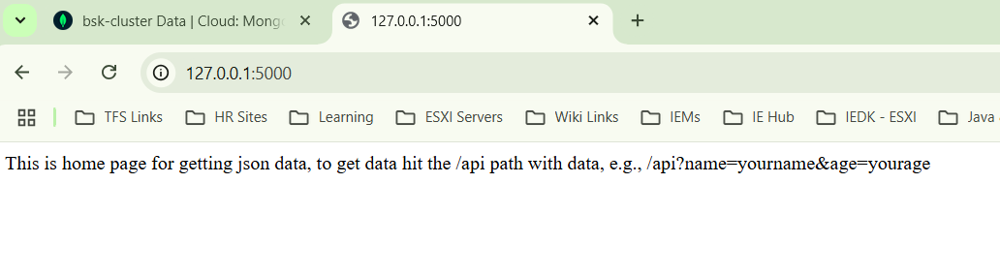
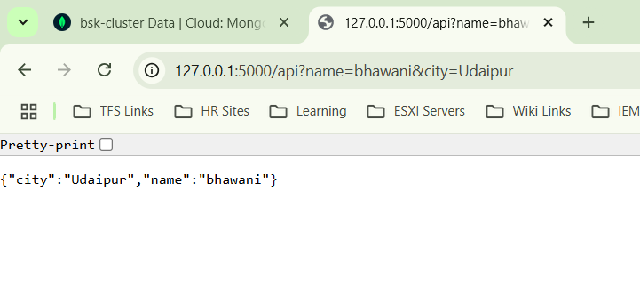
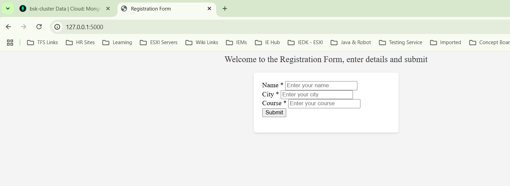
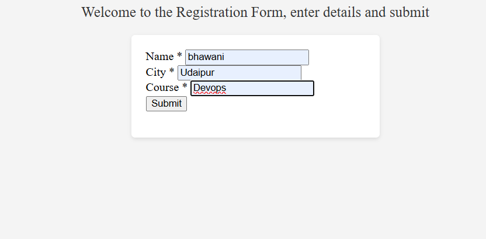
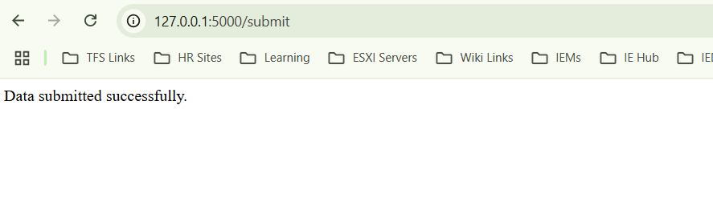
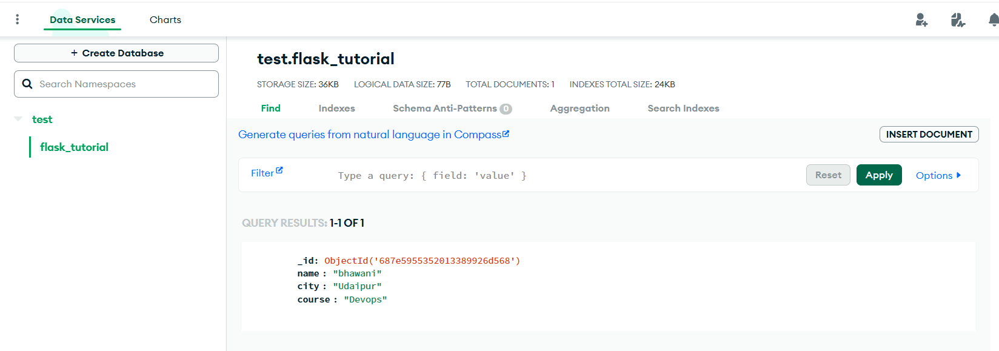

Screenshots are added in this file.
1. This is the home page for /api task.

2. This is the output when /api is hit with required details.

3. This is the home page for mongoDB task.

4. This is the when details are submited.

5. Database entry in MongoGB after submission

